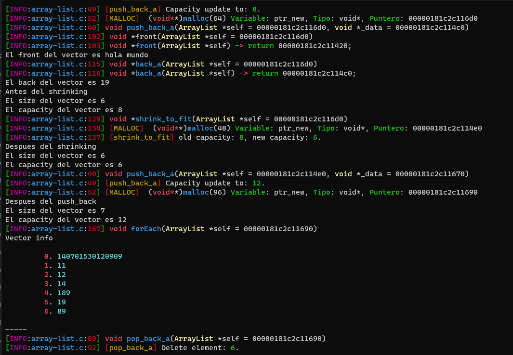

# array-list.h

----

Esta implementacion de vectores intenta hacerlo al estilo de C++. Para ello se usa array que se redimensionan y se ajustan a necesidad. 

Las funciones con las que se cuentan son las siguientes:

```C

/*
 *  
 *  createArrayList(self, _size, _value): Esta funcion se 
 *  encarga de construir un objeto ArrayList. 
 *  Recibe como parametros un puntero al objeto ArrayList (self),
 *  el tamaño inicial del array (_size), y el valor con el 
 *  que se llenará el array (_value). La funcion asigna 
 *  memoria para el array y lo inicializa con el valor especificado. 
 *  Esta funcion devuelve un puntero al objeto ArrayList construido.
 *  
 */
ArrayList *createArrayList(position _size, void *_value);

/*
 *  
 *  push_back_a(self, _data): Agrega un elemento al final del arreglo. 
 *  Recibe como parametros un puntero al objeto ArrayList (self)
 *  y el dato a agregar (_data).
 *  
 */
void push_back_a (ArrayList *self, void *_data);

/*
 *  
 *  pop_back_a(self): Elimina el ultimo elemento del array.
 * 
 */
void pop_back_a(ArrayList *self);

/*
 *  
 *  shrink_to_fit(self): Reduce la capacidad del 
 *  array para que coincida exactamente con la 
 *  cantidad de elementos almacenados.
 * 
 */
void shrink_to_fit(ArrayList *self);

/*
 *  
 *  size_a(self): Devuelve la cantidad de 
 *      elementos almacenados en el array.
 * 
 */
static inline position size_a(ArrayList *self);

/*
 *
 *  capacity(self): Devuelve la capacidad actual del array, 
 *  el tamaño maximo que puede alcanzar sin necesidad de 
 *  redimensionarlo.
 * 
 */
static inline position capacity(ArrayList *self);

/*
 *  
 *  back_a(self): Devuelve el ultimo elemento 
 *  del array.
 * 
 */
void *back_a(ArrayList *self);

/*
 *  
 *  front(self): Devuelve el primer 
 *  elemento del array.
 * 
 */
void *front(ArrayList *self);

/*
 *  
 *  Destroy(self): Libera la memoria asignada para 
 *  el arreglo y destruye el objeto ArrayList. 
 *  Devuelve un puntero nulo.
 * 
 */
void *Destroy(ArrayList *self);

/*
 *  
 *  forEach(self): Imprime por pantalla la informacion 
 *  del arreglo, mostrando cada elemento y su posicion.
 * 
 */
void forEach(ArrayList *self);
```

Puedes situar un ejemplo del uso de esta implementacion en `code_array-list.c`



----