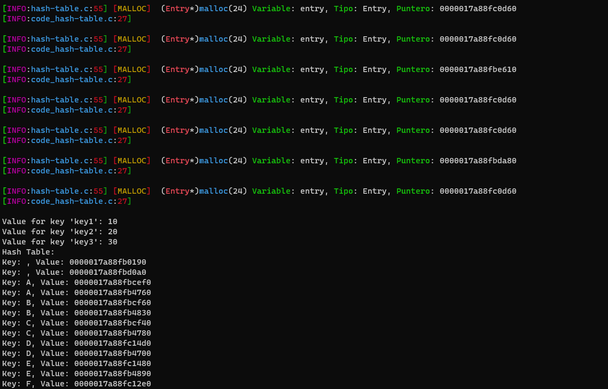

# hash-table.h

----

Esta implementacion de tablas de hash hace uso del algoritmo `hash djb2`, un algoritmo relativamente eficiente y debaja colision comunmente usado para este tipo de implementaciones.

Las funciones con las que contamos son las siguientes:
```C
HashTable* createHashTable(size_t size);
unsigned long hash(const char* str, size_t size);
void *get(HashTable *hashTable, const char *key);
void put(HashTable *hashTable, const char *key, void *value);
void printHashTable(HashTable *hashTable);
void freeHashTable(HashTable *hashTable);
```

Su uso son los siguientes:

```C
HashTable* createHashTable(size_t size);
``` 
Esta funcion se encarga de crear una tabla de hash, del tamaño de `size`.

```C
unsigned long hash(const char* str, size_t size);
``` 
Usted no usara normalmente esta funcion de forma directa, pues la funcion `get` lo hara por usted. Esta funcion permite obtener el hash de un `str`.

```C
void *get(HashTable *hashTable, const char *key);
``` 
Esta funcion le permite obtener los datos de la tabla hash mediante la key que uso para ingresar los mismos.

```C
void put(HashTable *hashTable, const char *key, void *value);
``` 
Esta funcion le permite ingresar datos en la tabla hash.


```C
void printHashTable(HashTable *hashTable);
``` 
Dicha funcion le permite ver el contenido de la tabla hash.

```C
void freeHashTable(HashTable *hashTable);
``` 
Liberar el contenido de la tabla hash

----

Recuerde liberar la memoria de forma adecuada de los datos ingresador mediante put, pues freeHashTable no se encarga de esto. Esta implementacion hasce uso de `debug_c.h` por lo que puede usar la macro `DEBUG_ENABLE` y usar `time_code.h` si usted precisa. Puede encontrar un ejemplo de uso de esta implememtacion en `code_hash-table.c`:



----