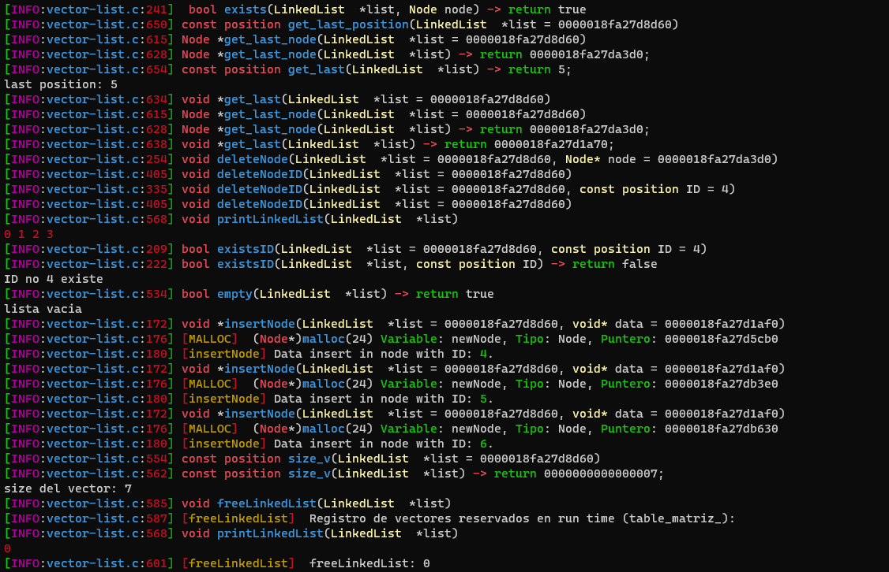

# vector-list.h

----

Esta implementacion de vectores usa listas enlazadas. Podremos debuguear nuestro programa definiendo la macro `DEBUG_ENABLE` y la macro `__VECTOR_LIST_DEBBUG__` antes de incluir la cabcera `vector-list.h`. Tambien podemos incluir la cabecera `time_code.h` depues de todas estas para obtener el tiempo de tardanza que tarda en ejecutarse nuestro programa con relativa precision.

Disponemos de las siguientes funciones:

```C

// Declaración de funciones de la lista enlazada
/**
 * Crea una nueva lista enlazada vacía.
 *
 * @return Puntero a la lista enlazada creada.
 */
LinkedList *createLinkedList();

/**
 * Obtiene un nodo de la lista enlazada en la posición dada.
 *
 * @param list Lista enlazada.
 * @param pos  Posición del nodo a obtener.
 * @return Puntero al nodo solicitado, o NULL si no se encuentra.
 */
Node *get_node(LinkedList *list, const position pos);

/**
 * Obtiene el último nodo de la lista enlazada.
 *
 * @param list Lista enlazada.
 * @return Puntero al último nodo de la lista, o NULL si la lista está vacía.
 */
Node *get_last_node(LinkedList *list);

/**
 * Elimina todos los nodos de la lista enlazada y libera la memoria.
 *
 * @param list Lista enlazada a limpiar.
 */
void clear(LinkedList *list);

/**
 * Inserta un nuevo nodo con el dato proporcionado al final de la lista enlazada.
 *
 * @param list Lista enlazada.
 * @param data Dato a insertar en el nuevo nodo.
 */
void insertNode(LinkedList *list, void *data);

/**
 * Elimina el nodo especificado de la lista enlazada.
 *
 * @param list Lista enlazada.
 * @param node Nodo a eliminar.
 */
void deleteNode(LinkedList *list, Node *node);

/**
 * Elimina el nodo con el ID especificado de la lista enlazada.
 *
 * @param list Lista enlazada.
 * @param ID   ID del nodo a eliminar.
 */
void deleteNodeID(LinkedList *list, const position ID);

/**
 * Actualiza los IDs de los nodos en la lista enlazada después de eliminar un nodo.
 *
 * @param list Lista enlazada.
 */
void updateIds(LinkedList *list);

/**
 * Imprime los IDs de los nodos en la lista enlazada.
 *
 * @param list Lista enlazada a imprimir.
 */
void printLinkedList(LinkedList *list);

/**
 * Libera la memoria utilizada por la lista enlazada y elimina los nodos de table_matriz_.
 *
 * @param list Lista enlazada a liberar.
 */
void freeLinkedList(LinkedList *list);

/**
 * Obtiene el dato almacenado en el nodo con el ID especificado.
 *
 * @param list Lista enlazada.
 * @param ID   ID del nodo.
 * @return Puntero al dato almacenado en el nodo, o NULL si no se encuentra.
 */
void *get_element_v(LinkedList *list, const position ID);

/**
 * Obtiene el dato almacenado en el último nodo de la lista enlazada.
 *
 * @param list Lista enlazada.
 * @return Puntero al dato almacenado en el último nodo, o NULL si la lista está vacía.
 */
void *get_last(LinkedList *list);

/**
 * Obtiene la posición del último nodo de la lista enlazada.
 *
 * @param list Lista enlazada.
 * @return Posición del último nodo, o -1 si la lista está vacía.
 */
const position get_last_position(LinkedList *list);

/**
 * Verifica si un nodo dado existe en la lista enlazada.
 *
 * @param list Lista enlazada.
 * @param node Nodo a buscar.
 * @return true si el nodo existe en la lista, false en caso contrario.
 */
bool exists(LinkedList *list, Node *node);

/**
 * Verifica si un nodo con el ID dado existe en la lista enlazada.
 *
 * @param list Lista enlazada.
 * @param ID   ID del nodo a buscar.
 * @return true si el nodo con el ID dado existe en la lista, false en caso contrario.
 */
bool existsID(LinkedList *list, const position ID);

/**
 * Verifica si la lista enlazada está vacía.
 *
 * @param list Lista enlazada.
 * @return true si la lista está vacía, false en caso contrario.
 */
bool empty(LinkedList *list);

/**
 * Inserta un nuevo nodo con el dato proporcionado al final de la lista enlazada y devuelve su posición.
 *
 * @param list Lista enlazada.
 * @param data Dato a insertar en el nuevo nodo.
 * @return Posición del nuevo nodo insertado.
 */
const position push_back_v(LinkedList *list, void *data);

/**
 * Elimina el último nodo de la lista enlazada y devuelve su posición.
 *
 * @param list Lista enlazada.
 * @return Posición del nodo eliminado, o -1 si la lista está vacía.
 */
const position pop_back_v(LinkedList *list);

/**
 * Obtiene la cantidad de nodos en la lista enlazada.
 *
 * @param list Lista enlazada.
 * @return Cantidad de nodos en la lista.
 */
const position size_v(LinkedList *list);

/**
 * Obtiene la posición del nodo especificado en la lista enlazada.
 *
 * @param node Nodo a obtener la posición.
 * @return Posición del nodo, o -1 si el nodo no pertenece a ninguna lista.
 */
const position get_position(Node *node);


/**
 * Libera la memoria utilizada por todos los vectores en la lista enlazada table_matriz_.
 */
void free_all_vector();
```

Recuerde que puede situar un ejemplo de uso de esta cabecera en `code_vector-list.c` y en `code-array-list_vector-list.c`




----